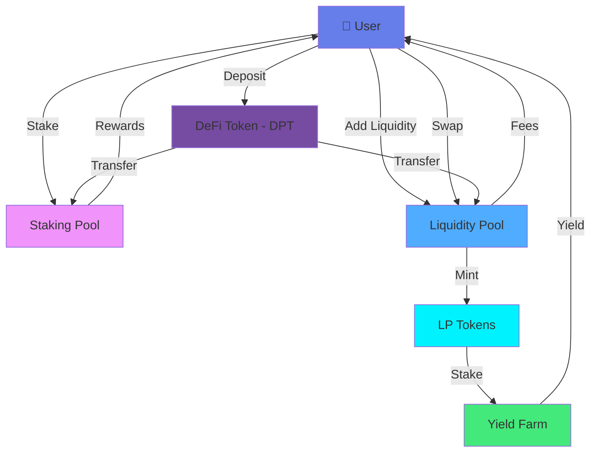

# 🚀 DeFi Protocol

<div align="center">


**A fully decentralized finance protocol with staking, AMM liquidity pools, and yield farming**

[📚 Documentation](#-smart-contracts) • [🛠️ Installation](#-quick-start) • [🧪 Testing](#-testing) • [🔐 Security](#-security)

</div>

---

## 📋 Table of Contents

- [Overview](#-overview)
- [Features](#-features)
- [Architecture](#-architecture)
- [Smart Contracts](#-smart-contracts)
- [Quick Start](#-quick-start)
- [Testing](#-testing)
- [Deployment](#-deployment)
- [Usage Examples](#-usage-examples)
- [Security](#-security)
- [Contributing](#-contributing)
- [License](#-license)

---

## 🌟 Overview

DeFi Protocol is a comprehensive decentralized finance platform built on Ethereum, offering a complete suite of DeFi primitives including token staking, automated market making (AMM), and yield farming. The protocol is designed with security, efficiency, and user experience in mind.

### Key Highlights

- 💎 **DPT Token**: Native ERC20 token powering the entire ecosystem
- 🏦 **Staking Pool**: Earn passive rewards by staking DPT tokens
- 💱 **AMM Liquidity Pool**: Provide liquidity and earn trading fees
- 🌾 **Yield Farming**: Maximize returns by staking LP tokens

---

## ✨ Features

<table>
<tr>
<td width="50%">

### 🪙 DeFi Token (DPT)
- ✅ ERC20 compliant
- ✅ Burnable & Mintable
- ✅ Ownership controls
- ✅ Transfer restrictions

</td>
<td width="50%">

### 🔒 Staking Pool
- ✅ Flexible staking periods
- ✅ Dynamic reward calculation
- ✅ Compound interest support
- ✅ Emergency withdrawal

</td>
</tr>
<tr>
<td width="50%">

### 💧 Liquidity Pool
- ✅ Constant product AMM (x*y=k)
- ✅ Token swapping mechanism
- ✅ LP token minting
- ✅ Slippage protection

</td>
<td width="50%">

### 🌾 Yield Farm
- ✅ LP token staking
- ✅ Boosted APY rewards
- ✅ Multiple reward tiers
- ✅ Auto-compounding

</td>
</tr>
</table>

---

## 🏗️ Architecture



---

## 📜 Smart Contracts

### Contract Overview

| Contract | Description | File |
|----------|-------------|------|
| **DefiToken** | ERC20 token implementation with minting capabilities | `DefiToken.sol` |
| **StakingPool** | Staking mechanism with time-locked rewards | `StakingPool.sol` |
| **LiquidityPool** | AMM-style constant product market maker | `LiquidityPool.sol` |
| **YieldFarm** | Advanced yield farming for LP token holders | `YieldFarm.sol` |

### Contract Details

#### 1️⃣ DefiToken.sol
```solidity
// ERC20 token with extended functionality
- Symbol: DPT
- Decimals: 18
- Initial Supply: Configurable
- Features: Mintable, Burnable, Ownable
```

#### 2️⃣ StakingPool.sol
```solidity
// Core Functions
- stake(uint256 amount)
- withdraw(uint256 amount)
- claimRewards()
- getRewardBalance(address user)
```

#### 3️⃣ LiquidityPool.sol
```solidity
// AMM Functions
- addLiquidity(uint256 amountA, uint256 amountB)
- removeLiquidity(uint256 lpAmount)
- swap(address tokenIn, uint256 amountIn)
- getAmountOut(uint256 amountIn)
```

#### 4️⃣ YieldFarm.sol
```solidity
// Yield Farming Functions
- deposit(uint256 lpAmount)
- withdraw(uint256 lpAmount)
- harvest()
- pendingRewards(address user)
```

---

## 🚀 Quick Start

### Prerequisites

Ensure you have the following installed:

```bash
Node.js >= 18.0.0
npm >= 9.0.0
Hardhat >= 2.19.0
```

### Installation

```bash
# Clone the repository
git clone https://github.com/yourusername/defi-protocol.git
cd defi-protocol

# Install dependencies
npm install

# Create environment file
cp .env.example .env
```

### Environment Configuration

Create a `.env` file in the root directory:

```env
# Private key for deployment (without 0x prefix)
PRIVATE_KEY=your_private_key_here

# Infura Project ID for network access
INFURA_PROJECT_ID=your_infura_project_id

# Optional: Etherscan API key for contract verification
ETHERSCAN_API_KEY=your_etherscan_api_key

# Network Configuration
NETWORK=sepolia
```

### Compile Contracts

```bash
# Compile all smart contracts
npx hardhat compile

# Clean and recompile
npx hardhat clean
npx hardhat compile
```

---

## 🧪 Testing

### Run Tests

```bash
# Run all tests
npx hardhat test

# Run specific test file
npx hardhat test test/DefiToken.test.js

# Run tests with gas reporting
REPORT_GAS=true npx hardhat test

# Run tests in verbose mode
npx hardhat test --verbose
```

### Test Coverage

```bash
# Generate coverage report
npx hardhat coverage

# View coverage in browser
open coverage/index.html
```

### Expected Test Output

```
  DefiToken
    ✓ Should deploy with correct initial supply (89ms)
    ✓ Should allow minting by owner (125ms)
    ✓ Should prevent minting by non-owner (67ms)
    ✓ Should allow token burning (98ms)

  StakingPool
    ✓ Should allow users to stake tokens (145ms)
    ✓ Should calculate rewards correctly (112ms)
    ✓ Should allow withdrawal with rewards (178ms)
    ✓ Should handle multiple stakers (234ms)

  LiquidityPool
    ✓ Should add liquidity and mint LP tokens (198ms)
    ✓ Should swap tokens correctly (156ms)
    ✓ Should calculate price impact (89ms)
    ✓ Should remove liquidity (167ms)

  YieldFarm
    ✓ Should accept LP token deposits (134ms)
    ✓ Should calculate pending rewards (98ms)
    ✓ Should distribute rewards correctly (189ms)
    ✓ Should handle harvest operations (145ms)

  16 passing (2.8s)
```

---

## 🌐 Deployment

### Deploy to Local Network

```bash
# Start local Hardhat node
npx hardhat node

# Deploy to local network (in another terminal)
npx hardhat run scripts/deploy.js --network localhost
```

### Deploy to Testnet

```bash
# Deploy to Sepolia testnet
npx hardhat run scripts/deploy.js --network sepolia

# Verify contracts on Etherscan
npx hardhat verify --network sepolia <CONTRACT_ADDRESS> <CONSTRUCTOR_ARGS>
```

### Deploy to Mainnet

```bash
# Deploy to Ethereum mainnet
npx hardhat run scripts/deploy.js --network mainnet

# Verify all contracts
npx hardhat run scripts/verify.js --network mainnet
```

### Deployment Configuration

Update `hardhat.config.js` with your network settings:

```javascript
networks: {
  localhost: {
    url: "http://127.0.0.1:8545"
  },
  sepolia: {
    url: `https://sepolia.infura.io/v3/${INFURA_PROJECT_ID}`,
    accounts: [PRIVATE_KEY]
  },
  mainnet: {
    url: `https://mainnet.infura.io/v3/${INFURA_PROJECT_ID}`,
    accounts: [PRIVATE_KEY]
  }
}
```

---

## 💻 Usage Examples

### Interacting with DefiToken

```javascript
const { ethers } = require("hardhat");

async function main() {
  const DefiToken = await ethers.getContractFactory("DefiToken");
  const token = await DefiToken.attach("CONTRACT_ADDRESS");
  
  // Check balance
  const balance = await token.balanceOf(userAddress);
  console.log("Balance:", ethers.utils.formatEther(balance));
  
  // Transfer tokens
  await token.transfer(recipientAddress, ethers.utils.parseEther("100"));
}
```

### Staking Tokens

```javascript
const StakingPool = await ethers.getContractFactory("StakingPool");
const staking = await StakingPool.attach("CONTRACT_ADDRESS");

// Approve tokens for staking
await token.approve(staking.address, ethers.utils.parseEther("1000"));

// Stake tokens
await staking.stake(ethers.utils.parseEther("1000"));

// Check rewards
const rewards = await staking.getRewardBalance(userAddress);
console.log("Pending rewards:", ethers.utils.formatEther(rewards));

// Claim rewards
await staking.claimRewards();
```

### Adding Liquidity

```javascript
const LiquidityPool = await ethers.getContractFactory("LiquidityPool");
const pool = await LiquidityPool.attach("CONTRACT_ADDRESS");

// Approve both tokens
await tokenA.approve(pool.address, ethers.utils.parseEther("1000"));
await tokenB.approve(pool.address, ethers.utils.parseEther("1000"));

// Add liquidity
await pool.addLiquidity(
  ethers.utils.parseEther("1000"),
  ethers.utils.parseEther("1000")
);

// Get LP token balance
const lpBalance = await pool.balanceOf(userAddress);
```

### Yield Farming

```javascript
const YieldFarm = await ethers.getContractFactory("YieldFarm");
const farm = await YieldFarm.attach("CONTRACT_ADDRESS");

// Approve LP tokens
await lpToken.approve(farm.address, ethers.utils.parseEther("100"));

// Deposit LP tokens
await farm.deposit(ethers.utils.parseEther("100"));

// Check pending rewards
const pending = await farm.pendingRewards(userAddress);
console.log("Pending yield:", ethers.utils.formatEther(pending));

// Harvest rewards
await farm.harvest();
```

---

## 🔐 Security

### Security Features

- ✅ **OpenZeppelin Standards**: Built on audited, industry-standard contracts
- ✅ **SafeMath Operations**: Protection against integer overflow/underflow
- ✅ **ReentrancyGuard**: Prevention of reentrancy attacks
- ✅ **Ownable Pattern**: Secure access control for admin functions
- ✅ **Pausable**: Emergency stop mechanism for critical situations
- ✅ **Time Locks**: Delayed execution for sensitive operations

### Audits

- 🔍 **Internal Security Review**: Completed ✓
- 🔍 **External Audit**: Pending
- 🐛 **Bug Bounty**: Active - Report vulnerabilities to security@defi-protocol.io

### Best Practices

```solidity
// Example: Reentrancy protection
function withdraw(uint256 amount) external nonReentrant {
    // State changes before external calls
    balances[msg.sender] -= amount;
    
    // External call last
    (bool success, ) = msg.sender.call{value: amount}("");
    require(success, "Transfer failed");
}
```

### Responsible Disclosure

If you discover a security vulnerability, please email us at:

📧 **security@defi-protocol.io**

**Please do not create public GitHub issues for security vulnerabilities.**

---

## 📊 Gas Optimization

Our contracts are optimized for gas efficiency:

| Operation | Gas Cost | Optimization |
|-----------|----------|--------------|
| Token Transfer | ~45,000 | Standard ERC20 |
| Stake | ~65,000 | Minimal storage writes |
| Add Liquidity | ~120,000 | Batch operations |
| Swap | ~95,000 | Optimized math |
| Harvest Rewards | ~75,000 | Efficient loops |

---

## 🛠️ Project Structure

```
defi-protocol/
├── contracts/
│   ├── DefiToken.sol           # ERC20 token implementation
│   ├── StakingPool.sol         # Staking mechanism
│   ├── LiquidityPool.sol       # AMM liquidity pool
│   └── YieldFarm.sol           # Yield farming contract
├── scripts/
│   ├── deploy.js               # Deployment script
│   └── verify.js               # Contract verification
├── test/
│   ├── DefiToken.test.js       # Token tests
│   ├── StakingPool.test.js     # Staking tests
│   ├── LiquidityPool.test.js   # Pool tests
│   └── YieldFarm.test.js       # Farm tests
├── hardhat.config.js           # Hardhat configuration
├── package.json                # Dependencies
└── README.md                   # This file
```

---

## 🤝 Contributing

We welcome contributions from the community! Here's how you can help:

### How to Contribute

1. **Fork the repository**
2. **Create a feature branch**
   ```bash
   git checkout -b feature/amazing-feature
   ```
3. **Commit your changes**
   ```bash
   git commit -m 'Add some amazing feature'
   ```
4. **Push to the branch**
   ```bash
   git push origin feature/amazing-feature
   ```
5. **Open a Pull Request**

### Contribution Guidelines

- Write clear, concise commit messages
- Add tests for new features
- Update documentation as needed
- Follow the existing code style
- Ensure all tests pass before submitting

### Development Setup

```bash
# Install development dependencies
npm install --save-dev

# Run linter
npm run lint

# Format code
npm run format

# Run local node for testing
npx hardhat node
```

---

## 📈 Roadmap

- [x] Core token implementation
- [x] Staking pool with rewards
- [x] AMM liquidity pool
- [x] Yield farming mechanism
- [ ] Governance module (DAO)
- [ ] Multi-chain deployment
- [ ] Integration with external protocols
- [ ] Mobile dApp interface
- [ ] Advanced analytics dashboard

---

## 📞 Support & Community

### Report Issues

Found a bug? [Create an issue](https://github.com/yourusername/defi-protocol/issues/new)

---

## 📄 License

This project is licensed under the MIT License - see the [LICENSE](LICENSE) file for details.

```
MIT License

Copyright (c) 2025 DeFi Protocol

Permission is hereby granted, free of charge, to any person obtaining a copy
of this software and associated documentation files (the "Software"), to deal
in the Software without restriction, including without limitation the rights
to use, copy, modify, merge, publish, distribute, sublicense, and/or sell
copies of the Software, and to permit persons to whom the Software is
furnished to do so, subject to the following conditions:

The above copyright notice and this permission notice shall be included in all
copies or substantial portions of the Software.
```

---

## 🙏 Acknowledgments

- [OpenZeppelin](https://openzeppelin.com/) - Secure smart contract library
- [Hardhat](https://hardhat.org/) - Ethereum development environment
- [Ethers.js](https://docs.ethers.org/) - Ethereum library
- Community contributors and supporters

---

<div align="center">

### ⭐ Star us on GitHub — it helps the project grow!

**Built with ❤️ by Vishal Nandy**

[⬆ Back to Top](#-defi-protocol)

<<<<<<< HEAD
</div>
=======
</div>
